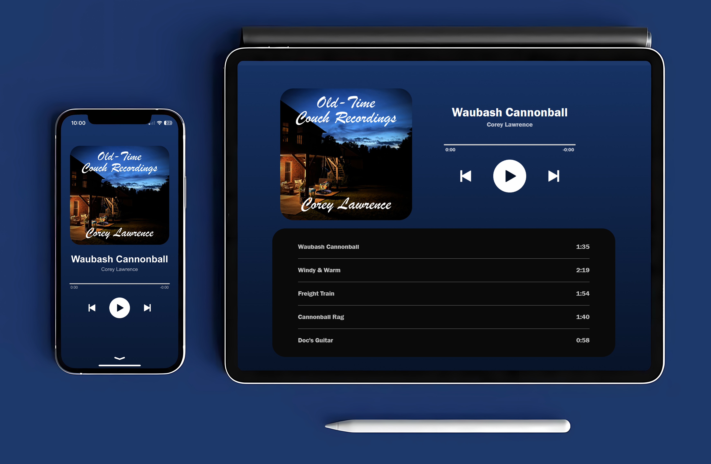

# Corey Lawrence Music Web App

Welcome to my personal music app! This progressive web app is built to provide an immersive, user-centered experience for enjoying my music. I designed this app with simplicity, responsiveness, and user-first design principles in mind, letting you dive into my tracks seamlessly from any device.

---

## Screenshots

---

## A Thoughtful, Streamlined Music Experience

The Corey Lawrence Music Web App reflects my approach to crafting technology that’s genuinely user-friendly and intuitive. It's not just a music player—it's a direct connection to my work, where you can explore tracks like "Waubash Cannonball" and "Doc's Guitar" with ease. Every feature is carefully designed to enhance your listening experience, whether you're on mobile, tablet, or desktop.

### Key Features:

- **Dynamic Song Menu**  
  The song menu is dynamically generated, making it easy to update the playlist and explore my tracks without needing constant changes to the app's code.

- **Interactive Progress Bar**  
  A real-time progress bar keeps you engaged, letting you track playback and navigate within songs intuitively.

- **Smooth Scrolling & Navigation**  
  Smooth-scrolling adds to the immersive feel, allowing for natural, uninterrupted exploration.

- **Media Session API Integration**  
  Control playback from your device’s lock screen or notification center, so you can enjoy music without needing to be in the app.

- **Responsive Design**  
  Optimized across all devices, the app adapts effortlessly to various screen sizes, giving you a beautiful experience anywhere.

- **Offline Availability**  
  Built to function offline, the app ensures you can enjoy music even without an internet connection.

---

## Getting Started

1. Visit [coreylawrencemusic.duckdns.org](https://coreylawrencemusic.duckdns.org).
2. Pick a song or hit play.
3. Enjoy a curated music experience wherever you are.

---

## Technology Stack

- **JavaScript:** Powers the dynamic features and smooth functionality of the player.
- **HTML & CSS:** Ensures a clean, accessible layout across devices.
- **Service Worker & Media Session API:** Supports offline functionality and intuitive media controls.

---

## Designed with Purpose

As with my other projects, this app embodies my commitment to creating technology that is as purposeful as it is user-friendly. The menu updates dynamically, using JavaScript to add new songs without requiring HTML adjustments. A swipe gesture opens and closes the menu, enhancing the overall experience.

### Advanced Media Control

With the Media Session API, the app offers playback control directly from your device's lock screen or notification center, letting you control the music seamlessly—wherever you are.

---

## Secure and Accessible

Hosted securely on a private server with Nginx and SSL via Let’s Encrypt, the Corey Lawrence Music Web App is available 24/7 for a safe and uninterrupted music experience.

---

Enjoy the music, and thanks for stopping by!
